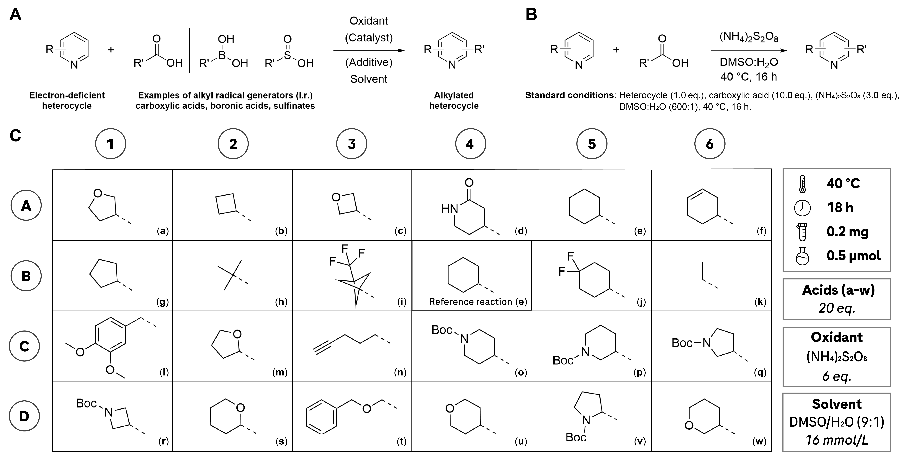
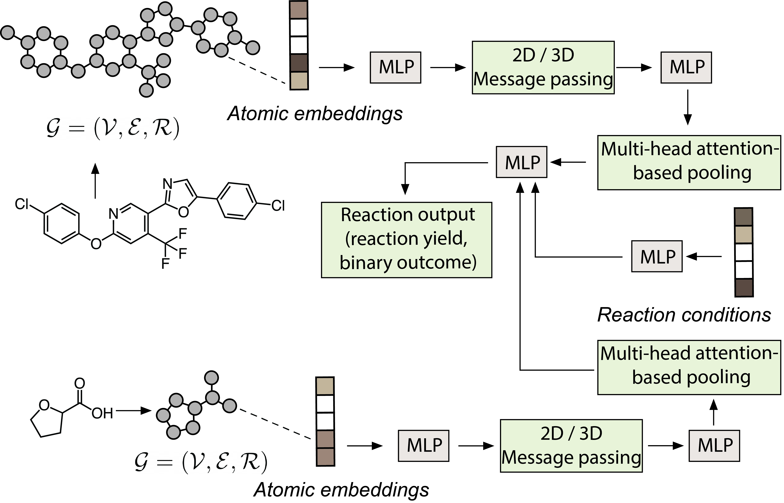

# Identifying opportunities for late-stage C-H alkylation with in silico reaction screening and high-throughput experimentation

[](https://www.python.org)
[](https://pytorch.org)
[](https://www.rdkit.org/)
[](https://github.com/psf/black)

[](https://doi.org/10.1000/XXX-X-XX-XXX-X_X)
[](https://juleskreuer.eu/projekte/citation-badge/)

This repository contains a reference implementation to preprocess the data train and apply the graph machine learning models for in silico reaction screening as introduced  by David F. Nippa, Kenneth Atz, Alex T. Müller, Clemens Isert, Jens Wolfard, Martin Binder, Oliver Scheidegger, David B. Konrad, Uwe Grether, Rainer E. Martin & Gisbert Schneider, Journal, X, XX (2023) (see [preprint](https://doi.org/10.26434/chemrxiv-2023-8hdmv)).

## Minisci chemistry:


## Graph machine learning:



## 1. Environment
Create and activate the minisci environment. If you don't use a GPU, leave out the line `- cudatoolkit=11.7` in `envs/environment.yml`.

```
cd envs/
conda env create -f environment.yml
conda activate minisci
poetry install
```

Add the "minisci path" as PYTHONPATH to your `~/.bashrc` file. 

```
export PYTHONPATH="${PYTHONPATH}:<YOUR_PATH>/minisci/"
```

Source your `~/.bashrc`.

```
source `~/.bashrc`
conda activate minisci
```

Test your installation by running `test_pyg.py`.

```
python test_pyg.py 
>>> torch_geometric.__version__: 2.3.0
>>> torch.__version__: 1.13.1
>>> rdkit.__version__: 2022.09.5
```

## 2. Data
The `data/` directory contains 7 files: 

1. `20230830_minisci_pub_all_data.tsv` containing all 1148 reactions published within the scope of this study, 
2. `20230830_minisci_pub_decoy.tsv` containing all decoy reactions,
3. `20230830_minisci_pub_hte.tsv` containing the HTE data
4. `20230830_minisci_pub_hte_new.tsv` containing the HTE reaction data of the validated literature reactions,
5. `20230830_minisci_pub_literature.tsv` containing the literature data, 
6. `template_acids.tsv` containing the SMILES-strings of all carboxylic acids, and
7. `template_substrates.tsv` cointaining the SMILES-strings of all substrates.
```
cd minisci/
ll data/
20230830_minisci_pub_all_data.tsv
20230830_minisci_pub_decoy.tsv
20230830_minisci_pub_hte.tsv
20230830_minisci_pub_hte_new.tsv
20230830_minisci_pub_literature.tsv
template_acids.tsv
template_substrates.tsv
```

## 3. Data preprocessing
`preprocess.py` loads the reaction data from `data/20230830_minisci_pub_all_data.tsv`, loops over the substrates, carboxylic acids and reaction conditions and calculates molecular graphs and different 3D conformations. 
```
python preprocess.py 
```
The generated files for substrates, carboxylic acids and reaction conditions are stored in `data/`.

```
ll data/
lsf_rxn_carbacids_20230830_minisci_pub_all_data.h5
lsf_rxn_cond_dicts_20230830_minisci_pub_all_data.pt
lsf_rxn_conditions_20230830_minisci_pub_all_data.h5
lsf_rxn_substrate_20230830_minisci_pub_all_data.h5
rxn_smi_dict_20230830_minisci_pub_all_data.pt
```

## 3. Model training and validation
The hyperparameters are stored in config files in `config/`. Model training using a 75 to 25 % dataset split can be started via `train.py`. config_700 runs the reaction yield prediction models and config_800 the binary reaction outcome models. `-cv` defined the cross-validation (1-3) and `-testset` the test set (1-4). 

```
cd gml/
python train.py -config 700 -mode a -cv 1 -testset 1
```

The training script generates two directories where the models (`models/`) and results (`results/`) are stored. 

After training all models using 3 cross-validations and all 4 test sets, model performance can be analyzed via `confusion_binary.py` (confusion matrix binary prediction), `confusion_yield.py` (confusion matrix reaction yield prediction), `loss_curve.py` (loss curves during training), and `get_outliers.py` (printing out the failed ML predictions with MAE > 75%). The plots are subsequently saved in `plots/`.

```
ll analysis/
confusion_binary.py
confusion_yield.py
get_outliers.py
loss_curve.py
```

## 4. Model application and in silico reaction screening

SMILES lists for substrates and carboxylic acids can be stored in 2 `.tsv` files as the two examples shown in `data/`. 

```
ll data/
template_acids.tsv
template_substrates.tsv
```

Once the two template files are defined and one model is trained, the `production.py` file can be run using the following parameters: `-config`: config file for the model; `-model_postfix`: model postfix, i.e., in this case, cross-validation number and test set number from training; `-acids`: acid template file; and `-substrates`: substrate template file.

```
cd gml/
python production.py -config 700 -model_postfix 1_2 -acids template_acids -substrates template_substrates
```

The prediction will be stored in `prediction/` generating 5 files, i.e. the scored molecules for substrates (`rxn_substrate_scoring_700.xlsx`, and `rxn_substrates_scoring_700.csv`), the scored molecules for the carboxylic acids (`rxn_acids_scoring_700.csv` and `rxn_acids_scoring_700.xlsx`), and the predictions for the individual reactions (`rxn_pred_700.csv`). In `rxn_pred_700.csv`, every combination of substrate + carboxylic acid and their prediction is stored. 

```
ll predictions/
rxn_acids_scoring_700.csv
rxn_acids_scoring_700.xlsx
rxn_pred_700.csv
rxn_substrate_scoring_700.xlsx
rxn_substrates_scoring_700.csv
```

## 5. License
The software was developed at ETH Zurich and is licensed by the MIT license, i.e. discribed in `LICENSE`.

## 6. Citation
```
@article{nippa_atz2023graph,
  title={Graph transformer neural network for chemical reactivity prediction},
  author={Nippa, David F and Atz, Kenneth and M{\"u}ller, Alex T and Wolfard, Jens and Isert, Clemens and Binder, Martin and Scheidegger, Oliver and Konrad, David B and Grether, Uwe and Martin, Rainer E and Schneider, Gisbert},
  year={2023},
  journal={ChemRxiv preprint 10.26434/chemrxiv-2023-8hdmv},
}
To Do: To be updated with DOI and journal.
```

